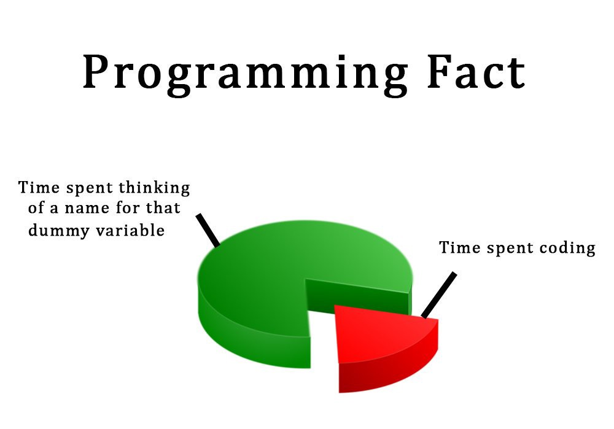
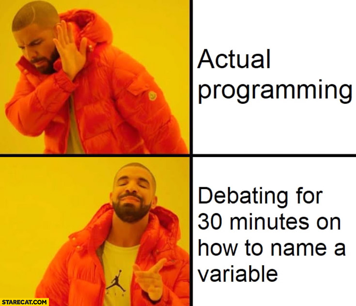

# Mysterious Name

[](https://starecat.com/actual-programming-vs-debating-30-minutes-on-how-to-name-a-variable-drake-meme/)

[](https://starecat.com/actual-programming-vs-debating-30-minutes-on-how-to-name-a-variable-drake-meme/)

Oh yes, we spend a lot of time deciding the best-ever, intuitive, the most clearest name we can come up with. We even do. But after a month, you find the name is confusing even for you.

It's not just only about finding correct names for code elements but making it readable and meaningful.

### 1. Change Function Declaration (124p)

##### Examples 
```c++

std::vector<BaseComponent*> items;
items->push_back(new Item1());
items->push_back(new Item2());
items->push_back(new Item3());
items->push_back(new Item4());

// Before
// It is clear. But it gets ambiguous when it comes to memory management of "clear" since "clear" could mean both.
void ContainerBase::Clear()
{
    mItems.clear();
}

// After
// Emphasize that this function will not deallocate the memory
void ContainerBase::ClearWithoutDelete()
{
    mItems.clear();
}

// And create another support function for deallocation all memories
void ContainerBase::DeleteAll()
{
    auto it = mItems.begin();
    for (;it != mItems.end(); it)
    {
        delete* it;
        it = mItems.erase(it);
    }
    ClearWithoutDelete();
}
```

### 2. Rename Variable (137p)

The variable names better contain detailed reason of being used.

##### Examples  
```javascript
// Before
ToggleButton* toggle = new ToggleButton(...);
Button* start = new Button(...);

// After
ToggleButton* toggleVisibility = new ToggleButton(...);
Button* startThread = new Button(...);
```

### 3. Rename Field (244p)

There is a good convention to develop or follow when naming instance variables(fields)

* Prefix with *m* : it is a member variable.
* Prefix with *p* : it is a pointer variable.

You get those advantages by following naming convention

* IntelliSense will bring all member variables by typing *m* only.
* All variables are very distinguishable in methods without *this* keyword.

##### Examples  
```c++
// Before
// These field names really have no clear meaning 
class ConfirmationDialog
{
private:
    TextEdit* name;
    Button* btn1;
    Button* btn2;
    Button* btn3;
}

// After
class ConfirmationDialog
{
private:
    TextEdit* mpDescription;
    Button* mpBtnOK;
    Button* mpBtnCancel;
    Button* mpBtnApply;
}
```