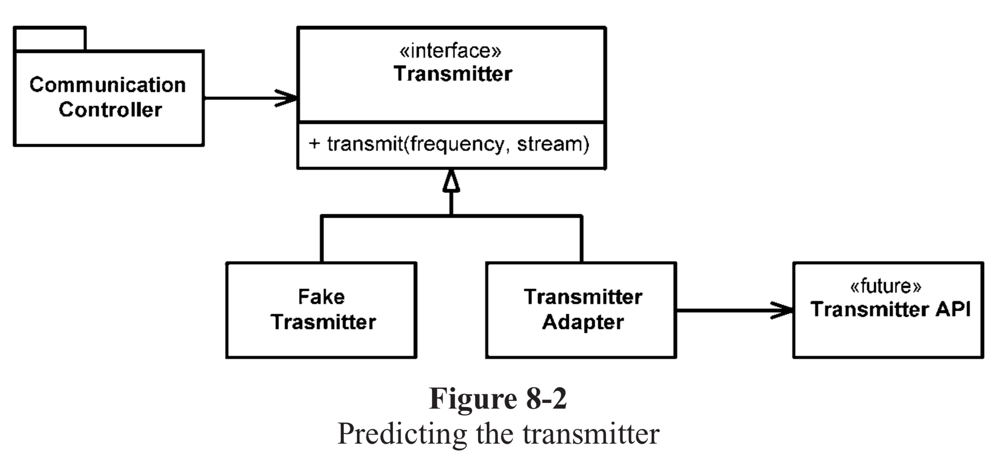

# Boundaries

### Using Third-Party Code
* Before
```java
Map sensors = new HashMap();

Sensor s = (Sensor)sensors.get(sensorId);
```
* After 1
```Java
Map<Sensor> sensors = new HashMap<Sensor>();

Sensor s = sensors.get(sensorId);
```

* After 2
```java
public class Sensors {
  private Map sensors = new HashMap();

  public Sensor getById(String id) {
    return (Sensor) sensors.get(id);
  }
}
```
* It results in code that is **easier to understand** and **harder to misuse**.
* We are advising you not to pass `Map`s (or any other interface at a boundary) around your system.
* Avoid returning it form, or accepting it as an argument to Public APIs.

### Exploring and Learning Boundaries
* Instead of experimenting and trying out the new stuff in our production code, we could **write some tests** to explore our understanding of the third-party code.
* The tests focus on what we want out of the API.

### Learning `log4j`
* We can encapsulate that knowledge into our own logger class so that the rest of our application is isolated from the `log4j` boundary interface.
  ```java
  public class LogTest {
    private Logger logger;f

    @Before
    public void initialize() {
      logger = Logger.getLogger("logger");
      logger.removeAllAppenders();
      Logger.getRootLogger().removeAllAppenders();
    }

    @Test
    public void basicLogger() {
      BasicConfigurator.configure();
      logger.info("basicLogger");
    }

    @Test
    public void addAppenderWithStream() {
      logger.addAppeender(new ConsoleAppender(
        new PatternLayout("%p %t %m%n"),
        ConsoleAppender.SYSTEM_OUT));
      logger.info("addAppenderWithStream");
    }

    @Test
    public void addAppenderWithoutStream() {
      logger.addAppender(new ConsoleAppender(
        new PatternLayout("%p %t %m%n")));
      logger.info("addAppenderWithoutStream");
    }
  }
  ```

### Learning Tests Are Better Than Free
* We had to learn the API anyway, and writing those tests was an easy and isolated way to get that knowledge.
* Learning tests verify that the third-party packages we are using work the way we expect them to.

### Using Code That Does Not Yet Exist
* There is another kind of boundary, one that separates the known from the unknown.



* By using our own application specific interface, we kept our `CommunicationsController` code clean and expressive.
* Once the transmitter API was defined, we wrote the `TransmitterAdapter` to bridge the gap.
* The ADAPTER encapsulated the interaction with the API and provides a single place to change when the API evolves.
* Using a suitable `FakeTransmitter`, we can test the `CommunicationsController` classes.
* We can also create boundary tests once we have the `TransmitterAPI` that make sure we are using the API correctly.

### Clean Boundaries
* Code at the boundaries needs clear separation and test that define expectations.
* We should avoid letting too much of our code know about the third-party particulars.
* Our code speaks to us better, promotes internally consistent usage across the boundary, and has fewer maintenance points when the third-party code changes.
> Good software designs accommodate change without huge investments and rework.
