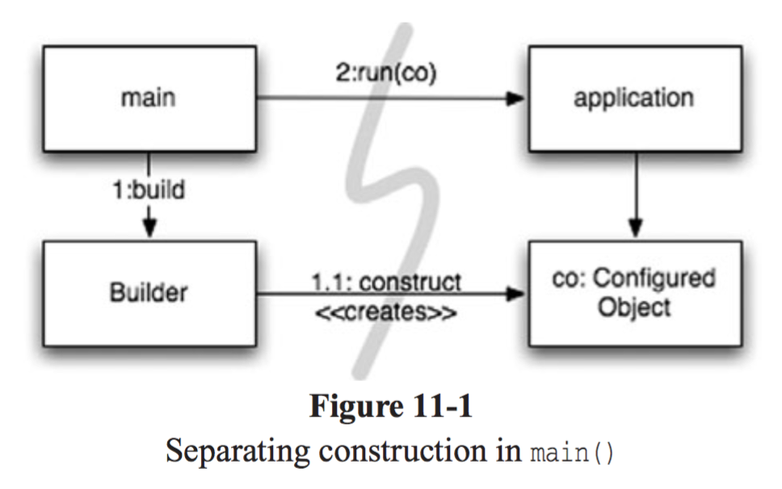
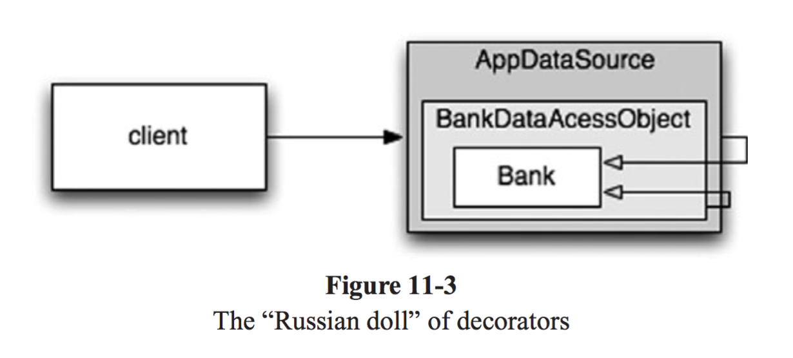

# Systems
### How Would You Build a City?
- Software teams are often organized like Cities.
- **Clean code** helps us achieve this at the **lower levels** of abstraction.
- The **system** helps us achieve this at the **higher levels** of abstraction.

### Separate Constructing a System from Using it.
- Software systems should separate the startup process, when the application objects are constructed and the dependencies are "wired" together, from the runtime logic that takes over after startup.
``` java
public Service getService() {
  if (service == null)
    service = new MyServiceImpl(...); // Good enough default for most cases?
  return service;
}
```
- Merits
  * We don't incur the overhead of construction unless we actually use the object.
  * Startup times can be faster as a result.
  * We also ensure that `null` is never returned.
- Problems
  * We have a hard-coded dependency on `MyserviceImpl` and everything its constructor requires.
  * We can't compile without resolving these dependencies, even if we never actually use an object of this type at runtime.
  * Testing can be a problem.
  * We do not know whether `MyServiceImpl` is the right object in all cases.
- We should modularize this process separately from the normal runtime logic and we should make sure that we have a global, consitent strategy for resolving our major dependencies.

##### Separation of Main
- Move all aspects of construction to `main`, or modules called by `main`, and to design the rest of the system assuming that all objects have been constructed and wired up appropriately.

##### Factories

- We can use the `ABSTRACT FACTORY` pattern to give the application control of when to build `LineItems`.


##### Dependency Injection
- A powerful mechanism for separating construction from use is _Dependency Injection_(DI), the application of _Inversion of Control (IoC) to dependency management.
- IoC moves secondary responsibilities from an object to other objects that are dedicated to the purpose, thereby supporting the _Single Responsibility Principle_.
```java
MyService myService = (MyService) (jndiContext.lookup("NameOfMyService"));
```

### Scaling Up
- It is a myth that we can get systems "right the first time". Instead, we should implement only today's stories, then refactor and expand the system to implement new stories tomorrow.
- Software systems are unique compared to physical systems. Their architectures can grow incrementally, if we maintain the proper separation of concerns.
```java
//An EJB2 local interface for a Bank EJB
package com.example.banking;
import java.util.Collections;
import javax.ejb.*;

public interface BankLocal extends java.ejb.EJBLocalObject {
  String getStreetAddr1() throws EJBException;
  String getStreetAddr2() throws EJBException;
  String getCity() throws EJBException;
  String getState() throws EJBException;
  String getZipCode() throws EJBException;
  void setStreetAddr1(String street1) throws EJBException;
  void setStreetAddr2(String street2) throws EJBException;
  void setCity(String city) throws EJBException;
  void setState(String state) throws EJBException;
  void setZipCode(String zip) throws EJBException;
  Collection getAccounts() throws EJBException;
  void setAccounts(Collection accounts) throws EJBException;
  void addAccount(AccountDTO accountDTO) throws EJBException;
}
```

```java
// The corresponding EJB2 Entity Bean Implementation
package com.example.banking;
import java.util.Collections;
import javax.ejb.*;

public abstract class Bank implements javax.ejb.EntityBean {
  // Business logic...
  public abstract String getStreetAddr1();
  public abstract String getStreetAddr2();
  public abstract String getCity();
  public abstract String getState();
  public abstract String getZipCode();
  public abstract void setStreetAddr1(String street1);
  public abstract void setStreetAddr2(String street2);
  public abstract void setCity(String city);
  public abstract void setState(String state);
  public abstract void setZipCode(String zip);
  public abstract Collection getAccounts();
  public abstract void setAccounts(Collection accounts);

  public void addAccount(AccountDTO accountDTO) {
      InitialContext context = new InitialContext();
      AccountHomeLocal accountHome = context.lookup("AccountHomeLocal");
      AccountLocal account = accountHome.create(accountDTO);
      Collection accounts = getAccounts();
      accounts.add(account);
  }

  // EJB container logic
  public abstract void setId(Integer id);
  public abstract Integer getId();
  public Integer ejbCreate(Integer id) { ... }
  public void ejbPostCreate(Integer id) { ... }

  // The rest had to be implemented but were usually empty:
  public void setEntityContext(EntityContext ctx) {}
  public void unsetEntityContext() {}
  public void ejbActivate() {}
  public void ejbPassivate() {}
  public void ejbLoad() {}
  public void ejbStore() {}
  public void ejbRemove() {}
}
```
- The business logic is tightly coupled to the EJB2 application "container". You must subclass container types and you must provide many lifecycle methods that are required by the container.
- Isolated unit testing is difficult. It is necessary to mock out the container, which is hard, or waste a lot of time deploying EJBs and tests to a real server.
- Object-oriented programming is undermined. One bean cannot inherit from another bean. This usually leads to redundant types holding essentially the same data, and it requires boilerplate code to copy data from one object to another.

##### Cross-Cutting Concerns
- The desired transactional, security, and some of the persistence behaviors are declared in the deployment descriptors, independently of the source code.
- The way the EJB architecture handled persistence, security, and transactions, "anticipated" aspect-oriented programming(AOP), which is a general-purpose approach to restoring modularity for cross-cutting concerns.

### Java Proxies
- Java proxies are suitable for simple situations, such as wrapping method calls in individual objects or classes.
```java
// Bank.java (suppressing package names...)
import java.utils.*;

// The abstraction of a bank.
public interface Bank {
  Collection<Account> getAccounts();
  void setAccounts(Collection<Account> accounts);
}

// BankImpl.java
import java.utils.*;

// The “Plain Old Java Object” (POJO) implementing the abstraction.
public class BankImpl implements Bank {
  private List<Account> accounts;

  public Collection<Account> getAccounts() {
      return accounts;
  }

  public void setAccounts(Collection<Account> accounts) {
      this.accounts = new ArrayList<Account>();
      for (Account account: accounts) {
          this.accounts.add(account);
      }
  }
}
// BankProxyHandler.java
import java.lang.reflect.*;
import java.util.*;

// “InvocationHandler” required by the proxy API.
public class BankProxyHandler implements InvocationHandler {
  private Bank bank;

  public BankHandler (Bank bank) {
    this.bank = bank;
  }

  // Method defined in InvocationHandler
  public Object invoke(Object proxy, Method method, Object[] args) throws Throwable {
    String methodName = method.getName();
    if (methodName.equals("getAccounts")) {
      bank.setAccounts(getAccountsFromDatabase());

      return bank.getAccounts();
    } else if (methodName.equals("setAccounts")) {
      bank.setAccounts((Collection<Account>) args[0]);
      setAccountsToDatabase(bank.getAccounts());

      return null;
    } else {
      ...
    }
  }

  // Lots of details here:
  protected Collection<Account> getAccountsFromDatabase() { ... }
  protected void setAccountsToDatabase(Collection<Account> accounts) { ... }
}

// Somewhere else...
Bank bank = (Bank) Proxy.newProxyInstance(
  Bank.class.getClassLoader(),
  new Class[] { Bank.class },
  new BankProxyHandler(new BankImpl())
);
```
- There is a lot of code here and it is relatively complicated, even for this simple case.
- This code "volume" and complexity are two of the drawbacks of proxies. They make it hard to create clean code.
- Also, proxies don't provide a mechanism for specifying system-wide execution "points" of interest, which is needed for a true AOP solution.

### Pure Java AOP Frameworks
- Fortunately, most of the proxy boilerplate can be handled automatically by tools. Proxies are used internally in several Java frameworks (Sprint AOP and JBoss AOP)
- In Spring, you write your business logic as Plain-Old Java Objects(POJO) and focus on their domain.
- They are conceptually simpler and easier to test drive.
```java
// Spring 2.X configuration file
<beans>
  ...
  <bean id="appDataSource"
    class="org.apache.commons.dbcp.BasicDataSource"
    destroy-method="close"
    p:driverClassName="com.mysql.jdbc.Driver"
    p:url="jdbc:mysql://localhost:3306/mydb"
    p:username="me"/>

  <bean id="bankDataAccessObject"
    class="com.example.banking.persistence.BankDataAccessObject"
    p:dataSource-ref="appDataSource"/>

  <bean id="bank"
    class="com.example.banking.model.Bank"
    p:dataAccessObject-ref="bankDataAccessObject"/>
  ...
</beans>
```


```java
XmlBeanFactory bf = new XmlBeanFactory(new ClassPathResource("app.xml", getClass()));
Bank bank = (Bank) bf.getBean("bank");
```
- The client believes it is invoking `getAccounts()` on a `Bank` object, but it is actually talking to the outermost of a set of nested DECORATOR objects that extend the basic behavior of the `Bank` POJO.
- Although XML can be verbose and hard to read, the "policy" specified in thes configuration files is simpler than the complicated proxy and aspect logic that is hidden from view and created automatically.

```java
// An EBJ3 Bank EJB
package com.example.banking.model;

import javax.persistence.*;
import java.util.ArrayList;
import java.util.Collection;

@Entity
@Table(name = "BANKS")
public class Bank implements java.io.Serializable {
  @Id @GeneratedValue(strategy=GenerationType.AUTO)
  private int id;

  @Embeddable // An object “inlined” in Bank’s DB row
  public class Address {
    protected String streetAddr1;
    protected String streetAddr2;
    protected String city;
    protected String state;
    protected String zipCode;
  }

  @Embedded
  private Address address;
  @OneToMany(cascade = CascadeType.ALL, fetch = FetchType.EAGER, mappedBy="bank")
  private Collection<Account> accounts = new ArrayList<Account>();
  public int getId() {
    return id;
  }

  public void setId(int id) {
    this.id = id;
  }

  public void addAccount(Account account) {
    account.setBank(this);
    accounts.add(account);
  }

  public Collection<Account> getAccounts() {
    return accounts;
  }

  public void setAccounts(Collection<Account> accounts) {
    this.accounts = accounts;
  }
}
```
- This code is much cleaner than the original EJB2 code.
- Some or all of the persistence information in the annotations can be moved to XML deployment descriptors, if desired, leaving a truly pure POJO.

### AspectJ Aspects
- The most full-featured tool for separating concerns through aspects is the AspectJ language, an extension of Java that provides "first-class" support for aspects as modularity constructs.
- It provides a very rich and powerful tool set for separating concerns.
- The drawback of AspectJ is the need to adopt several new tools and to learn new language constructs and usage idioms.

### Test Drive the System Architecture
- The poser of separating concerns through aspect-like approaches can't be overstated.
- You can evolve it from simple to sophisticated, as needed, by adopting new technologies on demand.
- An optimal system architecture consists of modularized domains of concern, each of which is implemented with Plain Old Java (or other) Objects. the different domains are integrated together with minimally invasive Aspects or Aspect-like tools, This architecture can be test-driven, just like the code.

### Optimize Decision Making
- Modularity and separation of concerns make decentralized management and decision making possible.
- We all know it is best to give responsibilities to the most qualified persons.
- The agility provided by a POJO system with modularized concerns allows us to make optimal, just-in-time decisions, based on the most recent knowledge. The complexity of these decisions is also reduced.

### Use Standards Wisely, When They Add Demonstrable Value
- Standards make it easier to reuse ideas and components, recruit people with relevant experience, encapsulate good ideas, and wire components together. However, the process of creating standards cna sometimes take too long for industry to wait and some standards lose touch with the real needs of the adopters they are intended to serve.

### Systems Need Domain-Specific Languages
- A good DSL minimizes the "communication gap" between a domain concept and the code that implements it, just a s agile practices optimize the communications within a team and with the project's stakeholders.
- Domain-Specific Languages allow all levels of abstraction and all domains in the application to be expressed as POJOs, from high-level policy to low0level details.

> Whether you are designing systems or individual modules, never forget to use the simplest thing that can possibly work.
