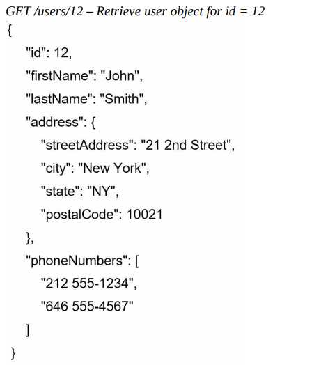

# 1. Scale From zero to Milions of Users
## (1) Single Server Setup


### - A single server setup (fg1-1)

Everything is running on one server( web app, database, cache, etc )


### - Request Flow & Traffic source

#### *Request Flow (fg1-2)*
```
1. 유저 도메인명 접속 (DNS(Domain name service)는 3rd party를 통한 유료서비스)
2. IP(internet protocol) 주소이 browser나 mobile app에 반환
3. IP가 주어지면, HTTP(Hypertext Transfer Protocol)의 Request가 directly your web server로 전달된다.
4. The web server가 렌더링을 위한 HTML page or Json response을 Return한다. 
```


#### *Traffic Source*
The traffic to your webserver는 두개의 sources(web application and mobile application)으로 온다.
```
1. web application: 두개의 combination 구성
 - server-side languages(Java, Python, etc) to handle business logic, storage, etc
 - front-side languages(HTML and JavaScript) for presentation

2. mobile application(API): HTTP protocol은 통신규약(communication protocol)로써 mobile app과 web server에 대함이다.
 - JSON(JavaScript Object Notation)이 가장 널리쓰이는 API response format to transfer data인데 이는 simplicity 때문이다.


  
```
###### JSON format 예시
 


Reference from 'System Design Interview' written by Alex Xu
