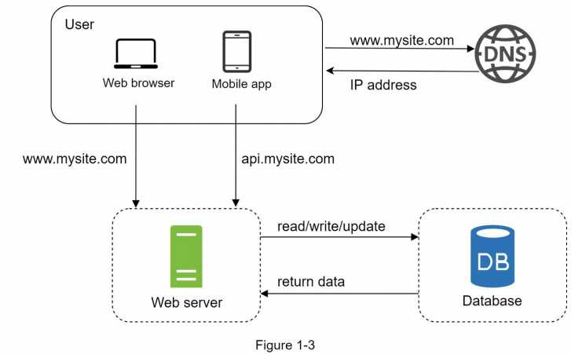
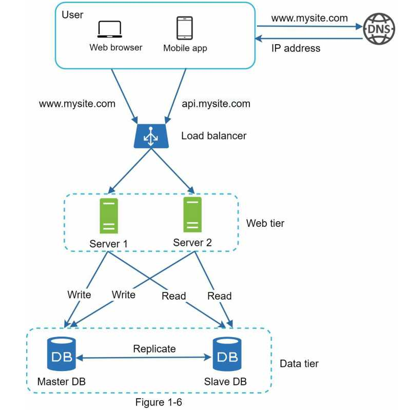
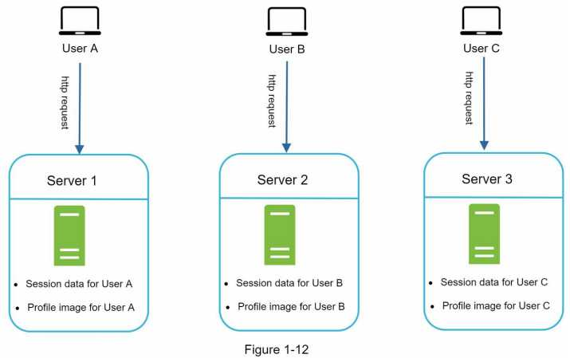
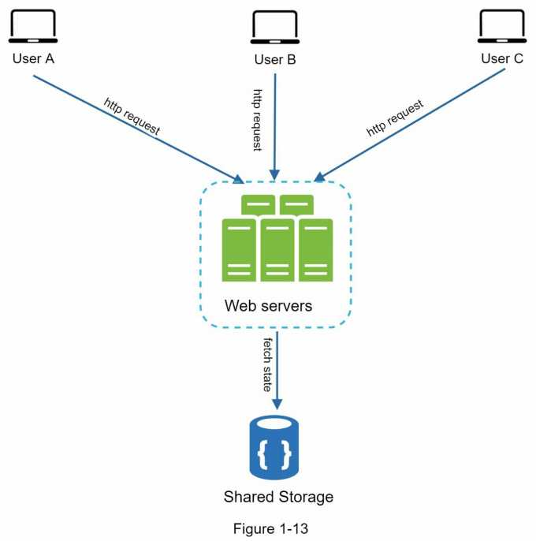
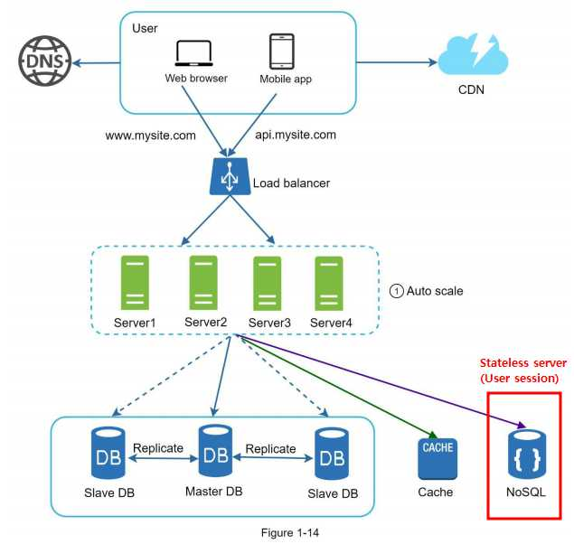
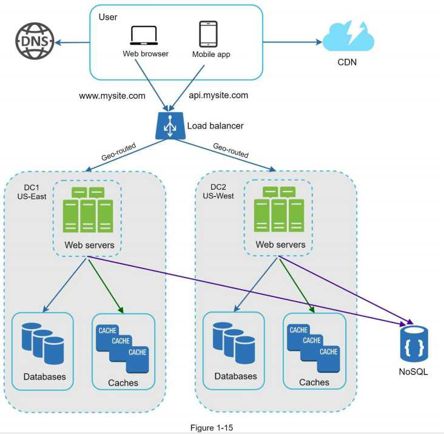
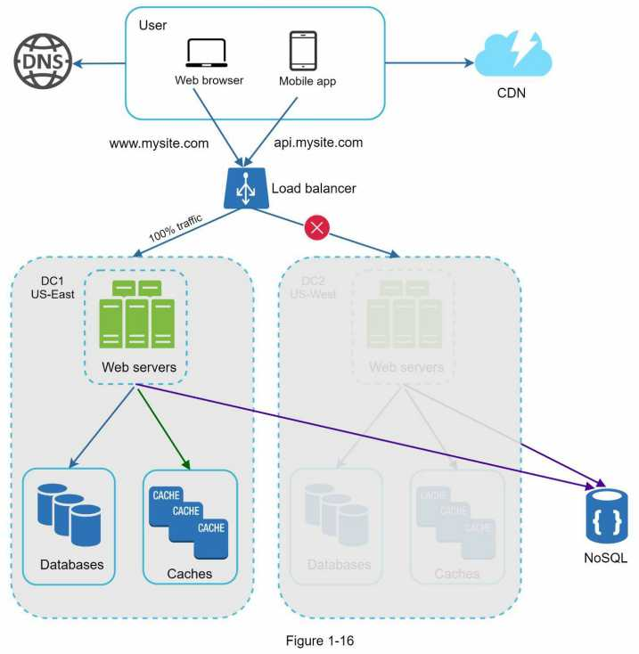
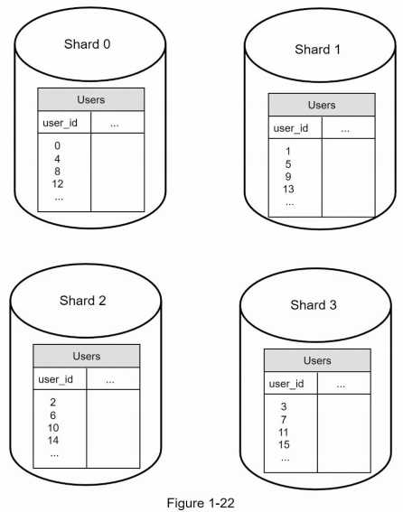

# 1. Scale From zero to Milions of Users
## (1) Single Server Setup


### - A single server setup (fg1-1)

Everything is running on one server( web app, database, cache, etc )


### - Request Flow & Traffic source

#### *Request Flow (fg1-2)*
```
1. 유저 도메인명 접속 (DNS(Domain name service)는 3rd party를 통한 유료서비스)
2. IP(internet protocol) 주소이 browser나 mobile app에 반환
3. IP가 주어지면, HTTP(Hypertext Transfer Protocol)의 Request가 directly your web server로 전달된다.
4. The web server가 렌더링을 위한 HTML page or Json response을 Return한다. 
```


#### *Traffic Source*
The traffic to your webserver는 두개의 sources(web application and mobile application)으로 온다.
```
1. web application: 두개의 combination 구성
 - server-side languages(Java, Python, etc) to handle business logic, storage, etc
 - front-side languages(HTML and JavaScript) for presentation

2. mobile application: HTTP protocol은 통신규약(communication protocol)로써 mobile app과 web server에 대함이다.
 - JSON(JavaScript Object Notation)이 가장 널리쓰이는 API response format to transfer data인데 이는 simplicity 때문이다. 
```
###### JSON format 예시
 

## (2) Database (multiple server case)

Say multiple servers are needed with the growth of the user base now.

Separating web/mobile traffic (web tier) and database (data tier)을 이용한 독립적 확장



Which databases to use(Relational database vs Non-relational database)?

#### *Relational database*
```
- called RDBMS(Relational database management system) or SQL database
- i.e.) MySQL, Oracle database, PostgreSQL, etc.
- data in tables and rows
- SQL join operations(O)

When to use?
 All cases except for the NoSQL database cases below
```

#### *Non-relational database*
```
- called NoSQL databases
- i.e.) CouchDB, Neo4j, Cassandra, HBase, Amazon DynamoDB, etc.
- four categories: key-value stores, graph stores, column stores, and document stores
- join operations(SQL) across different database tables
- SQL join operations(X)

When to use?
• Your application requires super-low latency(minimal delay).
• Your data are unstructured, or you do not have any relational data.
• You only need to serialize and deserialize data (JSON, XML, YAML, etc.).
• You need to store a massive amount of data.
```

## Vertical scaling vs horizontal scaling
#### *Vertical Scaling*👎
```
- called “scale up”
- more power (CPU, RAM, etc.) to your servers
- When traffic is low

But, Serious limitations
 • No unlimited CPU and memory to a single server.
 • No failover(장애조치) and redundancy(서버다중화). i.e. Server down😴 -> Website/App down😱
```

#### *horizontal Scaling*👍
```
- called  “scale-out”
- more servers into your pool of resources
- ✔ More Desirable for Large-Scale Applications( Due to the Vertical Scaling limit)
```

In the single server design(users -> the web server directly),

 case 1. Web server offline -> No user access
 
 case 2. Many users access simultaneously ->  Web server’s Load Limit -> Lower Response or Fail Response
 
To address this issue? Answer: **Load balancer.**
 
## (3) Load balancer - Web tier
: To distribute incoming traffic among web servers


```
the public IP(from user) -> Load balancer (Web server is unreachable directly by users)
Then,
separated to private IPs
- same network b/w servers
- not on the internet
- communication only through the private IPs.
```

one more server and load balancer(Web tier) -> no failover issue
```
• server 1 offline -> routed to server 2
: This prevents the website from going offline. 
• website traffic grows rapidly -> two servers are not enough 
: Adding more servers, then the load balancer automatically will handle them.
```

>One database does not support failover and redundancy. Database replication is a common technique to address those problems.

## (4) Database replication(DB복제) - data tier
Database replication can be used in many database management systems. 

A representative case is a master/slave relationship between the original (master) and the copies (slaves).

#### *Master/Slave DB replication*
```
Master DB
• Write operations(insert, delete, or update) only

Slave DB
• Read operations only

Read > Write (A higher ratio of Read operations to Write operations)
Therefore,
Slave DB > Master DB ( the number of Slave DB is larger than the number of Master DB )
```


#### *Advantages of database replication:*
```
• Better performance: 
  all Writes/Updates -> master nodes
  all Read -> slave nodes
  Therefore, More queries in parallel (higher performance)
  
• Reliability: 
  Say your database servers get destroyed (natural disaster: typhoon, earthquake, etc.) 
  Data is still preserved. No data loss! By DB replication across multiple locations.

• High availability: 
  Again, say your database servers are offline (natural disaster: typhoon, earthquake, etc.) 
  Users can still access the website and the data stored! By DB replication across multiple locations.
```

#### *High availability - DB replication:* 

>What if one of the databases goes offline? 

#### *If only one slave database is available:* 
```
• read operations will be directed to the master database temporarily
• As soon as the issue is found, a new slave database will replace the old one
```
#### *If multiple slave databases are available:* 
```
• read operations are redirected to other healthy slave databases
• A new database server will replace the old one
```
#### *If the master database goes offline:* 
```
• A slave database will be promoted to be the new master
• All the database operations will be temporarily executed on the new master database
• A new slave database will replace the old one for data replication immediately

#note
In production systems, promoting a new master is more complicated as the data in a slave database might not be up to date.
The missing data needs to be updated by running data recovery scripts.
Although some other replication methods like multi-masters and circular replication could help, those setups are more complicated.
```
### Load balancer(Web tier) + Database replication(data tier, DB복제)
두개의 조합(Load balancer(Web tier) + Database replication) 


```
• A user gets the IP address of the load balancer from DNS.
• A user connects the load balancer with this IP address.
• The HTTP request is routed to either Server 1 or Server 2.
• A web server reads user data from a slave database.
• A web server routes any data-modifying operations to the master database(write/update/delete operations).
```

## (5) Cache
Purpose: To improve the load/response time, add a cache layer and shift static content (JavaScript/CSS/image/video files) to the content delivery network (CDN).

> A cache is a temporary storage area that stores the result of expensive responses or frequently accessed data in memory so that subsequent requests are served more quickly.
```
New web pages loaded -> Fetching data by Database calls(repeatedly)-> Affecting application performance.
✔ The cache can mitigate this problem.
```
### Cache tier
The cache tier is a temporary data store layer, much faster than the database. 

#### *Benefits of a separate cache tier:* 
```
- Better system performance
- Ability to reduce database workloads
- Ability to scale the cache tier independently
```


```
Read-through cache Strategy
(1) Receiving a request
(2) A web server first checks if the cache has the available response
(3.1) If it has, it sends data back to the client.
(3.2) If not, it queries the database, stores the response in cache, and sends it back to the client.

Other caching Strategies
 - depending on the data type, size, and access patterns
```
A typical Memcached APIs
Memcached: Unlike databases that store data on disk or SSDs, Memcached keeps its data in memory


### Considerations for using cache
```
• Decide when to use cache.
  Consider using cache when data is read frequently but modified infrequently.
  Since cached data is stored in volatile memory, a cache server is not ideal for persisting data.
   For instance, if a cache server restarts, all the data in memory is lost.
   Thus, important data should be saved in persistent data stores.

• Expiration policy.
  It is a good practice to implement an expiration policy.
  Once cached data is expired, it is removed from the cache.
  When there is no expiration policy, cached data will be stored in the memory permanently.
    - Advisable not to make the expiration date too short -> the system reloads data from the DB too frequently. 
    - Advisable not to make the expiration date too long -> the data can become stale.

• Consistency:
  This involves keeping the data stored and the cache in sync.
  Inconsistency can happen because data-modifying operations on the data store and cache are not in a single transaction.
  When scaling across multiple regions, maintaining consistency between the data store and cache is challenging.

• Mitigating failures:
  A single cache server represents a potential single point of failure (SPOF),
  SPOF(single point of failure): a part of a system that, if it fails, will stop the entire system from working
   - Approach 1:  multiple cache servers across different data centers are recommended to avoid SPOF.
   - Approach 2:  overprovision the required memory by certain percentages.
  This provides a buffer as the memory usage increases.
```

```
  • Eviction Policy:
    Once the cache is full, any requests to add items to the cache -> existing items get removed(called cache eviction)
     - Least-recently-used (LRU) is the most popular cache eviction policy.
     - Least Frequently Used (LFU) or First in First Out (FIFO), can be adopted to satisfy different use cases.


```

## (6) Content delivery network (CDN)
Purpose: To improve the load/response time, add a cache layer and shift static content (JavaScript/CSS/image/video files) to the content delivery network (CDN).

> A CDN is a network of geographically dispersed servers used to deliver static content. CDN servers cache static content like images, videos, CSS, JavaScript files, etc.

#### How to use CDN to cache static content?
```
 - when a user visits a website, a CDN server closest to the user will deliver static content.
 - Intuitively, the further users are from CDN servers, the slower the website loads.
 For example, if CDN servers are in San Francisco, users in Los Angeles will get content faster than users in Europe. 
```

Figure 1-9 is a great example that shows how CDN improves load time.


```
1. User A tries to get image.png by using an image URL. The URL’s domain is provided by the CDN provider.
2. If the CDN server does not have image.png in the cache,
   the CDN server requests the file from the origin, which can be a web server or online storage like Amazon S3.
3. The origin returns image.png to the CDN server,
   which includes optional HTTP header Time-to-Live (TTL) which describes how long the image is cached.
4. The CDN caches the image and returns it to User A.
   The image remains cached in the CDN until the TTL expires.
5. User B sends a request to get the same image.
6. The image is returned from the cache as long as the TTL has not expired.
```
#### *Considerations of using a CDN* 
```
• Cost:
  CDNs are run by third-party providers, and you are charged for data transfers in and out of the CDN.
  Caching infrequently used assets provides no significant benefits so you should consider moving them out of the CDN.
• Setting an appropriate cache expiry:
  The cache expiry time should neither be too long nor too short.
   - Too long, no longer be fresh.
   - Too short, repeatedly reloading content from origin servers to the CDN.
• CDN fallback:
  You should consider how your website/application copes with CDN failure.
  If there is a temporary CDN outage, clients should be able to detect the problem and request resources from the origin.
• Invalidating files:
  You can remove a file from the CDN before it expires by performing one of the following operations:
   - Invalidate the CDN object using APIs provided by CDN vendors.
   - Use object versioning to serve a different version of the object. To version an object,
     you can add a parameter to the URL, such as a version number.
     For example, version number 2 is added to the query string: image.png?v=2
```
Figure 1-11 shows the design after the CDN and cache are added.

```
1. Static assets (JS, CSS, images, etc.,) are no longer served by web servers.
   They are fetched from the CDN for better performance.
2. The database load is lightened by caching data.
```


## (7) Stateless web tier - scaling the web tier horizontally
State (for instance user session data) should be moved out of the web tier.

A good practice is to store session data in persistent storage such as a relational database or NoSQL. 

Each web server in the cluster can access state data from databases, called 'stateless web tier'.

#### Key Difference - Stateful vs Stateless server
```
Stateful server: remembers client data (state) from one request to the next.
Stateless server: keeps no state information.
```

### Stateful architecture

```
(Figure 1-12)
 User A’s session data and profile image are stored in Server 1.
 To authenticate
  For User A, HTTP requests -> Server 1.
   If HTTP requests -> Server 2 or 3. >>>> Authentication Fail(Server 2 or 3 has no User A’s session data)
 Similarly, For User B, HTTP requests -> Server 2.
            For User C, HTTP requests -> Server 3.
 The issue is that every request from the same client must be routed to the same server.
 This can be done with sticky sessions in most load balancers; however, this adds the overhead💥
 Adding or removing servers is much more difficult with this approach.
 It is also challenging to handle server failures. 
```

### Stateless architecture

```
(Figure 1-13)
                         route
      HTTP requests(users) -> Server 1 or 2 or 3.
Then,   [user state data]  <- [shared data store]
                        fetched

In a nutshell, State data is stored in a shared data store and kept out of web servers.
A stateless system is simpler, more robust, and scalable.
```

```
(Figure 1-14)
we move the session data out of the web tier and store them in the persistent data store.
Shared data store: relational database, Memcached/Redis, NoSQL, etc.

For scaling,  NoSQL data store - it is easy to scale.
Autoscaling means adding or removing web servers automatically based on the traffic load.

After the state data is removed out of web servers,
auto-scaling of the web tier is easily achieved by adding or removing servers based on traffic load.
 If Your website grows rapidly & a significant number of users internationally,
 To improve availability and provide a better user experience,
 -> Multiple data centers is crucial.
```
## (8) Data centers

```
(Figure 1-15) - An example setup with two data centers
In normal operation, users are geoDNS-routed (also known as geo-routed) to the closest data center,
with a split traffic of x% in US-East and (100 – x)% in US-West.
geoDNS is a DNS service that allows domain names to be resolved to IP addresses based on the location of a user.
```


```
Data center outage -> All traffic is directed to a healthy data center.
(Figure 1-16) - Data center 2 (US-West) is offline/ 100% of the traffic routed to data center 1 (US-East)
```
#### Several technical challenges for Multi-data center setup
```
• Traffic redirection:
  Effective tools to direct traffic to the correct data center. 
   - GeoDNS is good to direct traffic to the nearest data center depending on where a user is located.
• Data synchronization(동기화이슈):
  Users from different regions could use different local databases or caches.
  예를 들어, In failover(시스템대체작동/장애대응작동) cases, traffic might be routed to a data center where data is unavailable. 
  A common strategy is to replicate data across multiple data centers.
  A previous study shows how Netflix implements asynchronous multi-data center replication.
• Test and deployment:
  With a multi-data center setup, it is important to test your website/application at different locations.
  Automated deployment tools are vital to keep services consistent through all the data centers.
```


To further scale our system, we need to decouple different components of the system so they can be scaled independently.
- Scalability - Independence가 Core
> Messaging queue is a key strategy!! It is employed by many real-world distributed systems for decoupled components.

## (9) Message queue
A message queue is 
```
 - a durable component,
 - stored in memory,
 - that supports asynchronous communication.
```

```
It serves as a buffer and distributes asynchronous requests.
The basic architecture of a message queue is simple.
 - Input services(called producers/publishers) -> create messages -> publish them to a message queue.
 - Other services or servers(called consumers/subscribers) -> connect to the queue -> perform actions defined by the messages. 
The model is shown in Figure 1-17.
```


```
🙌 Decoupling makes the message queue a preferred architecture for building a scalable and reliable application.
With the message queue, the producer can post a message to the queue when the consumer is unavailable to process it.
The consumer can read messages from the queue even when the producer is unavailable.
 case:
   - your application supports photo customization, including cropping, sharpening, blurring, etc.
   - Those customization tasks take time to complete.
   (In Figure 1-18, web servers publish photo processing jobs to the message queue)
   - Photo processing workers pick up jobs from the message queue and asynchronously perform photo customization tasks.
   - The producer and the consumer can be scaled independently.
   - When the size of the queue becomes large, more workers are added to reduce the processing time. 
     (However, if the queue is empty most of the time, the number of workers can be reduced)
```


## (10) Logging, metrics, automation
A website to serve a large business? 

Then, Multiple servers / Logging / Metrics / Automation support is essential🙆‍♂️.
```
Logging:
 Monitoring error logs -> to identify errors and problems in the system.
  • You can monitor error logs at per server level.
  • You can use tools to aggregate them to a centralized service for easy search and viewing.

Metrics (System metrics/Measurement types in systems):
 Collecting different types of metrics helps us to gain business insights and understand the health status of the system.
  Some of the following metrics are useful:
   • Host level metrics: CPU, Memory, disk I/O, etc.
   • Aggregated level metrics: Performance - entire database tier, cache tier, etc.
   • Key business metrics: daily active users, retention, revenue, etc.

Automation:
 Big and Complex systems -> Automation tools to improve productivity.
  Continuous integration: each code check-in is verified through automation, allowing teams to detect problems early.
  (Additional effect from automating(build, test, deploy process, etc.)-> higher developer productivity significantly)
```

#### Adding message queues and different tools
```
Figure 1-19: Updated design
Due to the space constraint, only one data center is shown in the figure.
 1. A message queue - Loosely coupled system and failure-resilient.
 2. Logging, monitoring, metrics, and automation tools are included.
```


As the data grows every day, your database gets more overloaded. It is time to scale the *Data Tier*.

## (11) Database scaling
#### Two broad approaches for database scaling
> Vertical scaling / Horizontal scaling
```
- Vertical scaling (Scaling up)
  : adding more power (CPU, RAM, DISK, etc.) to an existing machine.
    There are some powerful database servers. According to Amazon Relational Database Service (RDS),
    you can get a database server with 24 TB of RAM for lots of data.
      For example, stackoverflow.com in 2013 had over 10 million monthly unique visitors,
      but it only had 1 master database.
    However, vertical scaling comes with some serious drawbacks:
     • Hardware limits. Large user base -> a single server(X).
     • Greater risk of single point of failures.
     • The overall cost of vertical scaling is high. Powerful servers are much more expensive.

- Horizontal scaling (sharding)
 : adding more servers.
  Figure 1-20 compares vertical scaling with horizontal scaling.
```


```
  Sharding separates large databases into smaller, more easily managed parts called shards. 
  Each shard shares the same schema, though the actual data on each shard is unique to the shard.
  (Figure 1-21: an example of sharded databases)
  User data is allocated to a database server based on user IDs.
  Anytime you access data, a hash function is used to find the corresponding shard.
  In our example, user_id % 4 is used as the hash function.
  If the result equals to 0, shard 0 is used to store and fetch data.
  If the result equals to 1, shard 1 is used. 
  The same logic applies to other shards.
```


Figure 1-22 - user table in sharded databases.


```
The most important factor to consider when implementing a sharding strategy is the choice of the sharding key.
Sharding key (known as a partition key) consists of one or more columns that determine how data is distributed.
As shown in Figure 1-22, “user_id” is the sharding key.
A sharding key allows you to retrieve and modify data efficiently by routing database queries to the correct database.
When choosing a sharding key, one of the most important criteria is to choose a key that can evenly distributed data.
Sharding is a great technique to scale the database but it is far from a perfect solution.

It introduces complexities and new challenges to the system:

Resharding data:
 Resharding data is needed
  when 1) a single shard could no longer hold more data due to rapid growth.
       2) Certain shards might experience shard exhaustion faster than others due to uneven data distribution.
 When shard exhaustion happens, it requires updating the sharding function and moving data around.
 Consistent hashing, which will be discussed in Chapter 5, is a commonly used technique to solve this problem.

Celebrity problem:
 This is also called a hotspot key problem.
 Excessive access to a specific shard could cause server overload.
 Imagine data for Katy Perry, Justin Bieber, and Lady Gaga all end up on the same shard.
 For social applications, that shard will be overwhelmed with read operations.
 To solve this problem, we may need to allocate a shard for each celebrity.
 Each shard might even require further partition.

Join and de-normalization:
 Once a database has been sharded across multiple servers, it is hard to perform join operations across database shards.
 A common workaround is to de-normalize the database so that queries can be performed in a single table.
 In Figure 1-23, we shard databases to support rapidly increasing data traffic.
At the same time, some of the non-relational functionalities are moved to a NoSQL data store to reduce the database load.
Here is an article that covers many use cases of NoSQL [14].
```


#### (13) Millions of users and beyond
```
Scaling a system is an iterative process. 
Iterating on what we have learned in this chapter could get us far. 
More fine-tuning and new strategies are needed to scale beyond millions of users. 
For example, you might need to optimize your system and decouple the system to even smaller services. 
All the techniques learned in this chapter should provide a good foundation to tackle new challenges. 
To conclude this chapter, we provide a summary of how we scale our system to support millions of users:
• Keep web tier stateless
• Build redundancy at every tier
• Cache data as much as you can
• Support multiple data centers
• Host static assets in CDN
• Scale your data tier by sharding
• Split tiers into individual services
• Monitor your system and use automation tools
```

#### Reference from 'System Design Interview' written by Alex Xu
