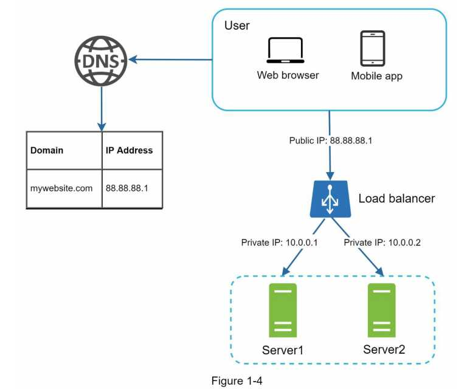
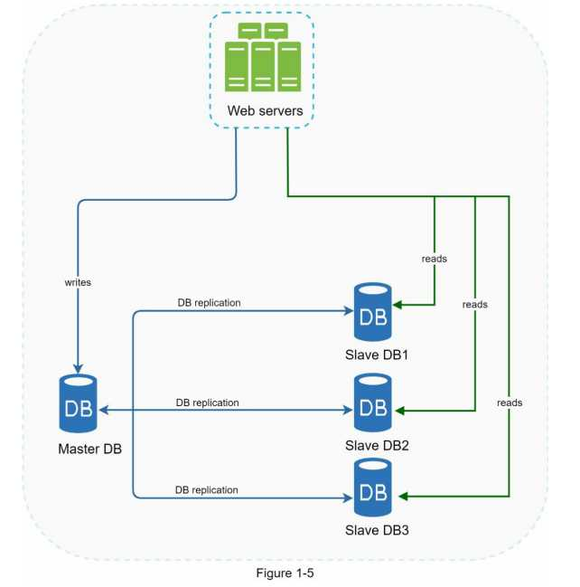

# 1. Scale From zero to Milions of Users
## (1) Single Server Setup


### - A single server setup (fg1-1)

Everything is running on one server( web app, database, cache, etc )


### - Request Flow & Traffic source

#### *Request Flow (fg1-2)*
```
1. 유저 도메인명 접속 (DNS(Domain name service)는 3rd party를 통한 유료서비스)
2. IP(internet protocol) 주소이 browser나 mobile app에 반환
3. IP가 주어지면, HTTP(Hypertext Transfer Protocol)의 Request가 directly your web server로 전달된다.
4. The web server가 렌더링을 위한 HTML page or Json response을 Return한다. 
```


#### *Traffic Source*
The traffic to your webserver는 두개의 sources(web application and mobile application)으로 온다.
```
1. web application: 두개의 combination 구성
 - server-side languages(Java, Python, etc) to handle business logic, storage, etc
 - front-side languages(HTML and JavaScript) for presentation

2. mobile application: HTTP protocol은 통신규약(communication protocol)로써 mobile app과 web server에 대함이다.
 - JSON(JavaScript Object Notation)이 가장 널리쓰이는 API response format to transfer data인데 이는 simplicity 때문이다. 
```
###### JSON format 예시
 

## (2) Database (multiple server case)

Say multiple servers are needed with the growth of the user base now.

Separating web/mobile traffic (web tier) and database (data tier)을 이용한 독립적 확장


Which databases to use(Relational database vs Non-relational database)?

#### *Relational database*
```
- called RDBMS(Relational database management system) or SQL database
- i.e.) MySQL, Oracle database, PostgreSQL, etc.
- data in tables and rows
- SQL join operations(O)

When to use?
 All cases except for the NoSQL database cases below
```

#### *Non-relational database*
```
- called NoSQL databases
- i.e.) CouchDB, Neo4j, Cassandra, HBase, Amazon DynamoDB, etc.
- four categories: key-value stores, graph stores, column stores, and document stores
- join operations(SQL) across different database tables
- SQL join operations(X)

When to use?
• Your application requires super-low latency(minimal delay).
• Your data are unstructured, or you do not have any relational data.
• You only need to serialize and deserialize data (JSON, XML, YAML, etc.).
• You need to store a massive amount of data.
```

## (3) Vertical scaling vs horizontal scaling
#### *Vertical Scaling*👎
```
- called “scale up”
- more power (CPU, RAM, etc.) to your servers
- When traffic is low

But, Serious limitations
 • No unlimited CPU and memory to a single server.
 • No failover(장애조치) and redundancy(서버다중화). i.e. Server down😴 -> Website/App down😱
```

#### *horizontal Scaling*👍
```
- called  “scale-out”
- more servers into your pool of resources
- ✔ More Desirable for Large-Scale Applications( Due to the Vertical Scaling limit)
```

In the single server design(users -> the web server directly),

 case 1. Web server offline -> No user access
 
 case 2. Many users access simultaneously ->  Web server’s Load Limit -> Lower Response or Fail Response
 
To address this issue? Answer: **Load balancer.**
 
## (4) Load balancer - Web tier
: To distribute incoming traffic among web servers



```
the public IP(from user) -> Load balancer (Web server is unreachable directly by users)
Then,
separated to private IPs
- same network b/w servers
- not on the internet
- communication only through the private IPs.
```

one more server and load balancer(Web tier) -> no failover issue
```
• server 1 offline -> routed to server 2
: This prevents the website from going offline. 
• website traffic grows rapidly -> two servers are not enough 
: Adding more servers, then the load balancer automatically will handle them.
```

>One database does not support failover and redundancy. Database replication is a common technique to address those problems.

## (5) Database replication(DB복제) - data tier
Database replication can be used in many database management systems. 

A representative case is a master/slave relationship between the original (master) and the copies (slaves).

#### *Master/Slave DB replication*
```
Master DB
• Write operations(insert, delete, or update) only

Slave DB
• Read operations only

Read > Write (A higher ratio of Read operations to Write operations)
Therefore,
Slave DB > Master DB ( the number of Slave DB is larger than the number of Master DB )
```


#### *Advantages of database replication:*
```
• Better performance: 
  all Writes/Updates -> master nodes
  all Read -> slave nodes
  Therefore, More queries in parallel (higher performance)
  
• Reliability: 
  Say your database servers get destroyed (natural disaster: typhoon, earthquake, etc.) 
  Data is still preserved. No data loss! By DB replication across multiple locations.

• High availability: 
  Again, say your database servers are offline (natural disaster: typhoon, earthquake, etc.) 
  Users can still access the website and the data stored! By DB replication across multiple locations.
```

#### *High availability - DB replication:* 

>What if one of the databases goes offline? 

#### *If only one slave database is available:* 
```
• read operations will be directed to the master database temporarily
• As soon as the issue is found, a new slave database will replace the old one
```
#### *If multiple slave databases are available:* 
```
• read operations are redirected to other healthy slave databases
• A new database server will replace the old one
```
#### *If the master database goes offline:* 
```
• A slave database will be promoted to be the new master
• All the database operations will be temporarily executed on the new master database
• A new slave database will replace the old one for data replication immediately

#note
In production systems, promoting a new master is more complicated as the data in a slave database might not be up to date.
The missing data needs to be updated by running data recovery scripts.
Although some other replication methods like multi-masters and circular replication could help, those setups are more complicated.
```
## Load balancer(Web tier) + Database replication(data tier, DB복제)
두개의 조합(Load balancer(Web tier) + Database replication) 


```
• A user gets the IP address of the load balancer from DNS.
• A user connects the load balancer with this IP address.
• The HTTP request is routed to either Server 1 or Server 2.
• A web server reads user data from a slave database.
• A web server routes any data-modifying operations to the master database(write/update/delete operations).
```

## (6) Cache
To improve the load/response time, add a cache layer and shift static content (JavaScript/CSS/image/video files) to the content delivery network (CDN).

## (7) Content delivery network (CDN)
## (8) Stateless web tier
## (9) Data centers
## (10) Message queue
## (11) Logging, metrics, automation
## (12) Database scaling


Reference from 'System Design Interview' written by Alex Xu
