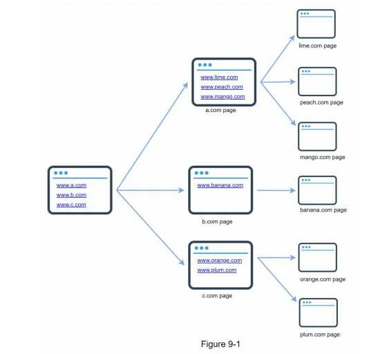
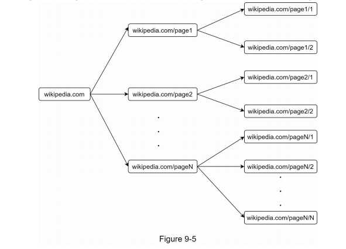

# CHAPTER 9: DESIGN A WEB CRAWLER

A web crawler is known as a robot or spider.  

It is widely used by search engines to discover new or updated content(a web page, an image, a video, a PDF file, etc) on the web. 

A web crawler starts by collecting a few web pages and then follows links on those pages to collect new content.(Figure 9-1)



#### Purpose
```
• Search engine indexing:
   This is the most common use case. A crawler collects web pages to create a local index for search engines.
    (For example) Googlebot is the web crawler behind the Google search engine.
• Web archiving:
   This is the process of collecting information from the web to preserve data for future uses.
    (For example) many national libraries run crawlers to archive web sites. Notable examples are the US Library of Congress [1] and the EU web archive [2].
• Web mining:
   The explosive growth of the web presents an unprecedented opportunity for data mining.
   Web mining helps to discover useful knowledge from the internet.
    (For example) top financial firms use crawlers to download shareholder meetings and annual reports to learn key company initiatives.
• Web monitoring.
   The crawlers help to monitor copyright and trademark infringements over the Internet.
    (For example) Digimarc [3] utilizes crawlers to discover pirated works and reports.
```

The complexity of developing a web crawler depends on the scale we intend to support. 
It could be either a small school project, 
  which takes only a few hours to complete or a gigantic project that requires continuous improvement from a dedicated engineering team. 
Thus, we will explore the scale and features to support below.

## Step 1 - Understand the problem and establish design scope

The basic algorithm of a web crawler:
```
1. Given a set of URLs, download all the web pages addressed by the URLs.
2. Extract URLs from these web pages
3. Add new URLs to the list of URLs to be downloaded. Repeat these 3 steps.
```

To understand the requirements and establish design scope:
• Functionalities:
- The main purpose of the crawler? search engine indexing? data mining? something else?
- How many web pages does the web crawler collect per month?
- What content types? HTML only, PDFs and images.
- Newly added or edited web pages? 
- Do we need to store HTML pages crawled from the web?
- Duplicate content?

• Scalability: 
  The web is very large. There are billions of web pages out there. 
  Web crawling should be extremely efficient using parallelization.
• Robustness: 
  The web is full of traps. 
  Bad HTML, unresponsive servers, crashes, malicious links, etc. are all common. 
  The crawler must handle all those edge cases.
• Politeness: 
  The crawler should not make too many requests to a website within a short time interval.
• Extensibility: 
  The system is flexible so that minimal changes are needed to support new content types. 
    For example, if we want to crawl image files in the future, we should not need to redesign the entire system.  

### Back of the envelope estimation

• Estimations(assumptions)
  - Assume 1 billion web pages are downloaded every month.
  - QPS: 1,000,000,000 / 30 days / 24 hours / 3600 seconds = ~400 pages per second.
  - Peak QPS = 2 * QPS = 800
  - Assume the average web page size is 500k.
  - 1-billion-page x 500k = 500 TB storage per month. If you are unclear about digital storage units, go through “Power of 2” section in Chapter 2 again.
  - Assuming data are stored for five years, 500 TB * 12 months * 5 years = 30 PB. A 30 PB storage is needed to store five-year content.

## Step 2 - Propose high-level design and get buy-in


#### Seed URLs
seed URLs = a starting point for the crawl process

The general strategy
1. locality : Different countries may have different popular websites.
2. topics : shopping, sports, healthcare, etc
   
#### URL Frontier
The component that stores URLs to be downloaded is called the URL Frontier.

#### HTML Downloader
The HTML downloader downloads web pages from the internet. Those URLs are provided by the URL Frontier.
#### DNS Resolver
To download a web page, a URL must be translated into an IP address. 
The HTML Downloader calls the DNS Resolver to get the corresponding IP address for the URL. 
  For instance, URL www.wikipedia.org is converted to IP address 198.35.26.96 as of 3/5/2019.
  
#### Content Parser
```
After a web page is downloaded, it must be parsed and validated
because malformed web pages could provoke problems and waste storage space. 
Implementing a content parser in a crawl server will slow down the crawling process.
Thus, the content parser is a separate component.
```
#### Content Seen?
```
Online research [6] reveals that 29% of the web pages are duplicated contents,
which may cause the same content to be stored multiple times. 
We introduce the “Content Seen?” data structure to eliminate data redundancy and shorten processing time. 
It helps to detect new content previously stored in the system. 
To compare two HTML documents, we can compare them character by character. 
However, this method is slow and time-consuming, especially when billions of web pages are involved. 
An efficient way to accomplish this task is to compare the hash values of the two web pages [7].
```
#### Content Storage
```
It is a storage system for storing HTML content. 
The choice of storage system depends on factors such as data type, data size, access frequency, life span, etc. 
Both disk and memory are used.
• Most of the content is stored on disk because the data set is too big to fit in memory.
• Popular content is kept in memory to reduce latency.
```
#### URL Extractor
```
URL Extractor parses and extracts links from HTML pages.
Figure 9-3 shows an example of a link extraction process.
Relative paths are converted to absolute URLs by adding the “https://en.wikipedia.org” prefix.
```

#### URL Filter
The URL filter excludes certain content types, file extensions, error links and URLs in “blacklisted” sites.
#### URL Seen?
```
“URL Seen?” is a data structure that keeps track of URLs that are visited before or already in the Frontier.
“URL Seen?” helps to avoid adding the same URL multiple times as this can increase server load and cause potential infinite loops.
Bloom filter and hash table are common techniques to implement the “URL Seen?” component.
We will not cover the detailed implementation of the bloom filter and hash table here.
For more information, refer to the reference materials [4] [8].
```
#### URL Storage
```
URL Storage stores already visited URLs. So far, we have discussed every system component. 
Next, we put them together to explain the workflow.
```
#### Web crawler workflow
```
To better explain the workflow step-by-step, sequence numbers are added in the design diagram as shown in Figure 9-4.
```

```
Step 1: Add seed URLs to the URL Frontier
Step 2: HTML Downloader fetches a list of URLs from URL Frontier.
Step 3: HTML Downloader gets IP addresses of URLs from DNS resolver and starts downloading.
Step 4: Content Parser parses HTML pages and checks if pages are malformed.
Step 5: After content is parsed and validated, it is passed to the “Content Seen?” component.
Step 6: “Content Seen” component checks if a HTML page is already in the storage.
  • If it is in the storage, this means the same content in a different URL has already been processed.
        In this case, the HTML page is discarded.
  • If it is not in the storage, the system has not processed the same content before. T
        he content is passed to Link Extractor.
Step 7: Link extractor extracts links from HTML pages.
Step 8: Extracted links are passed to the URL filter.
Step 9: After links are filtered, they are passed to the “URL Seen?” component.
Step 10: “URL Seen” component checks if a URL is already in the storage,
        if yes, it is processed before, and nothing needs to be done.
Step 11: If a URL has not been processed before, it is added to the URL Frontier.
```

## Step 3 - Design deep dive
#### DFS vs BFS

#### URL frontier
```
URL frontier helps to address these problems
(The web is large and not every page has the same level of quality and importance. 
  Therefore, we may want to prioritize URLs according to their page ranks, web traffic, update frequency, etc). 
A URL frontier is a data structure that stores URLs to be downloaded. 
The URL frontier is an important component to ensure politeness, URL prioritization, and freshness.
```
##### Politeness

##### Priority
##### Freshness
##### Storage for URL Frontier

### HTML Downloader
###### Robots.txt
###### Performance optimization
```
1. Distributed crawl
2. Cache DNS Resolver
3. Locality
4. Short timeout
```
