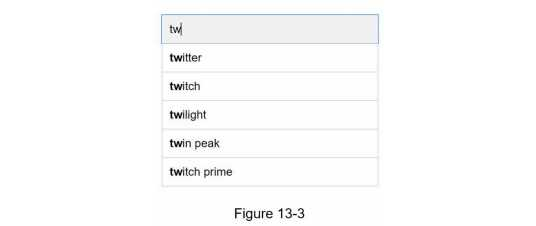

# CHAPTER 13: DESIGN A SEARCH AUTOCOMPLETE SYSTEM

Design a search autocomplete system, also called “design top k” or “design top k most searched queries”.


## Step 1 - Understand the problem and establish design scope

###  Requirements

```
Here is a summary of the requirements:
  • Fast response time: 
      As a user types a search query, autocomplete suggestions must show up fast enough. 
      An article about Facebook’s autocomplete system reveals that the system needs to return results within 100 milliseconds. 
      Otherwise it will cause stuttering.
  • Relevant: 
      Autocomplete suggestions should be relevant to the search term.
  • Sorted: 
      Results returned by the system must be sorted by popularity or other ranking models.
  • Scalable: 
      The system can handle high traffic volume.
  • Highly available: 
      The system should remain available and accessible when part of the 
  system is offline, slows down, or experiences unexpected network errors.
```

### Back of the envelope estimation
```
• Assume 10 million daily active users (DAU).
• An average person performs 10 searches per day.
• 20 bytes of data per query string:
• Assume we use ASCII character encoding. 1 character = 1 byte
• Assume a query contains 4 words, and each word contains 5 characters on average.
• That is 4 x 5 = 20 bytes per query.
• For every character entered into the search box, a client sends a request to the backend for autocomplete suggestions.
  On average, 20 requests are sent for each search query.
  For example, the following 6 requests are sent to the backend by the time you finish typing 
      “dinner”.
      search?q=d
      search?q=di
      search?q=din
      search?q=dinn
      search?q=dinne
      search?q=dinner
• ~24,000 query per second (QPS) = 10,000,000 users * 10 queries / day * 20 characters / 24 hours / 3600 seconds.
• Peak QPS = QPS * 2 = ~48,000
• Assume 20% of the daily queries are new.
    10 million * 10 queries / day * 20 byte per query * 20% = 0.4 GB.
    This means 0.4GB of new data is added to storage daily.  
```

## Step 2 - Propose high-level design and get buy-in

At the high-level,
> • *Data gathering service*: It gathers user input queries and aggregates them in real-time. 
Real-time processing is not practical for large data sets; however, it is a good starting 
point. We will explore a more realistic solution in deep dive.

> • *Query service*: Given a search query or prefix, return 5 most frequently searched terms.

### Data gathering service
How data gathering service works?
```
Assume we have a frequency table that stores the query string and its frequency as shown in Figure 13-2.
In the beginning, the frequency table is empty.
Later, users enter queries “twitch”, “twitter”, “twitter,” and “twillo” sequentially.
Figure 13-2 shows how the frequency table is updated.
```


### Query service
```
Assume we have a frequency table as shown in Table 13-1.
It has two fields.
• Query: it stores the query string.
• Frequency: it represents the number of times a query has been searched.
```


```
When a user types “tw” in the search box, the following top 5 searched queries are displayed (Figure 13-3),
assuming the frequency table is based on Table 13-1.
```


```
To get top 5 frequently searched queries, execute the following SQL query:
```


```
This is an acceptable solution when the data set is small.
When it is large, accessing the database becomes a bottleneck. We will explore optimizations in deep dive.
```

## Step 3 - Design deep dive
Components & Optimizations 
```
• Trie data structure
• Data gathering service
• Query service
• Scale the storage
• Trie operations
```

### Trie data structure


